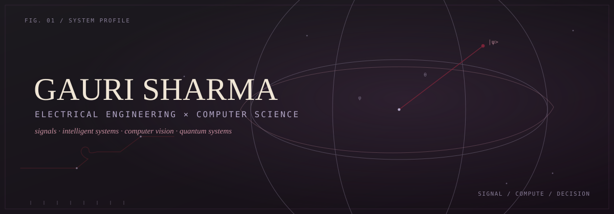
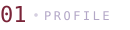
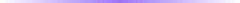
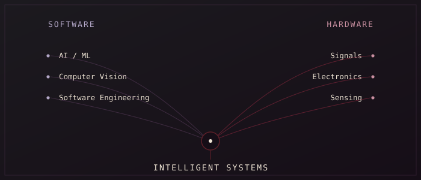
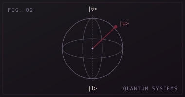
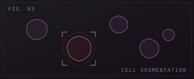
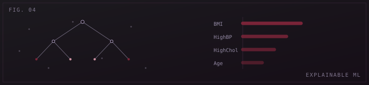
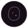

<code>currently exploring → quantum systems</code> 

 

[**Portfolio**](https://totallymaniac.github.io/gauri-portfolio/) &nbsp;·&nbsp; [**Résumé**](https://totallymaniac.github.io/gauri-portfolio/Gauri-Sharma-Resume.pdf) &nbsp;·&nbsp; [**LinkedIn**](https://www.linkedin.com/in/gauri-sharma-6b501325b/) &nbsp;·&nbsp; [**Email**](mailto:gstechland100@gmail.com)
 

  

 

## Who I am

Final-year student at the **University of Sydney**, completing a **Bachelor of Engineering (Honours) — Electrical Engineering** alongside a **Bachelor of Science — Computer Science**. I work in the space where a signal becomes data, and data becomes a decision.

Building intelligent systems where software meets the physical world.

 

## Currently building

<table>
<tr><td width="50%" valign="top">

**01 · Interactive Bloch Sphere Simulator** — Electrical Engineering Honours thesis
`HONOURS THESIS · IN PROGRESS`

An interactive simulator for single-qubit states and driven quantum dynamics, visualised on the Bloch sphere.

**Working on** single-qubit states & Bloch sphere representation · quantum gates & Hamiltonian evolution · density matrices, Rabi-driven dynamics

**Next** — open-system dynamics (relaxation & dephasing), full interactive visualisation layer

`Python` `NumPy` `SciPy` `Matplotlib` `Streamlit`

</td><td width="50%" valign="top">

**02 · Cell Annotator** — University software engineering project
`COURSE PROJECT · IN PROGRESS`

A human-in-the-loop platform for cell segmentation and AI-assisted model training on whole-slide pathology images.

**Working on** AI-assisted cell segmentation · editable, human-in-the-loop prediction workflow · local deployment & model selection/upload

**Next** — broader deep-learning model support

`PyTorch` `MONAI` `SegResNet` `nnU-Net` `SwinUNETR` `Flask` `React`

</td></tr>
</table>

 

## Projects & case studies

The Bloch sphere simulator and Cell Annotator are covered above in `currently_building` — this section is everything else.

**FEATURED WORK**

**Diabetes Risk Predictor** — AI · Data · Explainable ML

A complete health-data ML workflow: data cleaning and preprocessing, Random Forest classification, and SHAP-based explainability, wrapped in a usable interactive risk-prediction interface.

`Python` `Random Forest` `SHAP` `scikit-learn`

[**Repository →**](https://github.com/TotallyManiac/diabetes-2-risk-predictor) &nbsp;·&nbsp; [**Live Demo →**](https://diabetes2predictorprototype.netlify.app)

 

<table>
<tr><td width="12%" align="center" valign="top"></td><td width="38%" valign="top">

**Alzheimer's MRI Classification**
Medical Imaging · Signal Processing · Machine Learning
End-to-end pipeline — skull stripping, registration, AAL ROI extraction — feeding an RBF SVM classifier for AD/NC prediction.
`Python` `FSL` `NiftyReg` `scikit-learn`

</td><td width="12%" align="center" valign="top"></td><td width="38%" valign="top">

**High-Speed Fan Diagnostics** — Nanosonics
Electrical Engineering · Signal Processing · Embedded Systems
Detection of underperforming high-speed fans (~33,000 RPM): Hall-effect/tachometer sensing, RC filtering, frequency analysis — validated live at a trade-show demo.
`Sensing` `Filtering` `Embedded Systems`

</td></tr>
</table>

 

## Languages · frameworks · engineering

<table>
<tr>
<td valign="top"> <b>Languages</b> Python · C · Java · MATLAB · R · SQL</td>
<td valign="top"> <b>AI / ML / Vision</b> PyTorch · scikit-learn · OpenCV · MONAI</td>
</tr>
<tr>
<td valign="top"> <b>Scientific / Engineering</b> NumPy · SciPy · MATLAB · P4 · Mininet</td>
<td valign="top"> <b>Software / Web</b> React · Flask · Git · GitHub · Docker</td>
</tr>
</table>

 

## Recent work

-  **2026.02** → validated fan diagnostic system at 33,000 RPM
-  **2026.08** → shipped portfolio v1
-  **2026.09** → building interactive Bloch sphere simulator
-  **2026.09** → developing cell segmentation workflows

<!-- Add new engineering.log entries above this comment, newest last. Format: -  **YYYY.MM** → what you did -->

 

## Teaching · mentoring · interests

⚡ **Electrical Engineering**
signals · sensing · electronics · systems

🧑‍🏫 **Teaching**
programming tutor (Girls Programming Network) · engineering peer mentor (USYD)

🔬 **Research & Mentoring**
quantum systems · BIOTech Futures team mentor

 

*quietly convinced every good system is one part physics, one part stubbornness.*

 

### Connect

[Portfolio](https://totallymaniac.github.io/gauri-portfolio/) &nbsp;·&nbsp; [LinkedIn](https://www.linkedin.com/in/gauri-sharma-6b501325b/) &nbsp;·&nbsp; [GitHub](https://github.com/TotallyManiac) &nbsp;·&nbsp; [Email](mailto:gstechland100@gmail.com)

built by hand, updated when there's something worth logging.

